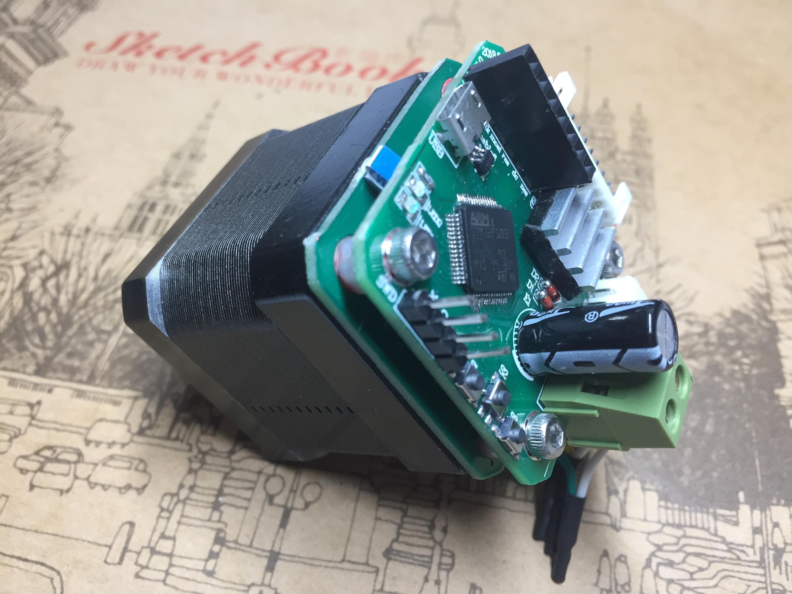

# ApexServo

# 版本更新日志

# 如何编译
开发环境为Keil_MDK V5.25.2.0

# 如何下载固件
PCB预留SWD接口可用于程序的下载与调试

# 如何校准编码器
以下情况需要进行一次编码器校准，否则将造成电机震荡或无法工作(校准指令请参照下方指令说明)

1.初次使用时

2.重新安装PCB与电机

3.出现电机工作异常可先进行一次编码器校准以检查是否为编码器故障

# 指令说明
指令通过串口发送与接收，波特率为115200。每条指令后必须加上\r或\n或\r\n,即Enter。

可通过串口指令配置以下参数(pgv_pid,p_pid,v_pid,模式目标,控制参数,控制,读取,帮助)。

完整指令请查看IS.cpp

# 联系
如果您想参与该版本的维护或者有疑问请联系 365475000@163.com

# 购买方式
https://item.taobao.com/item.htm?id=571973300271
